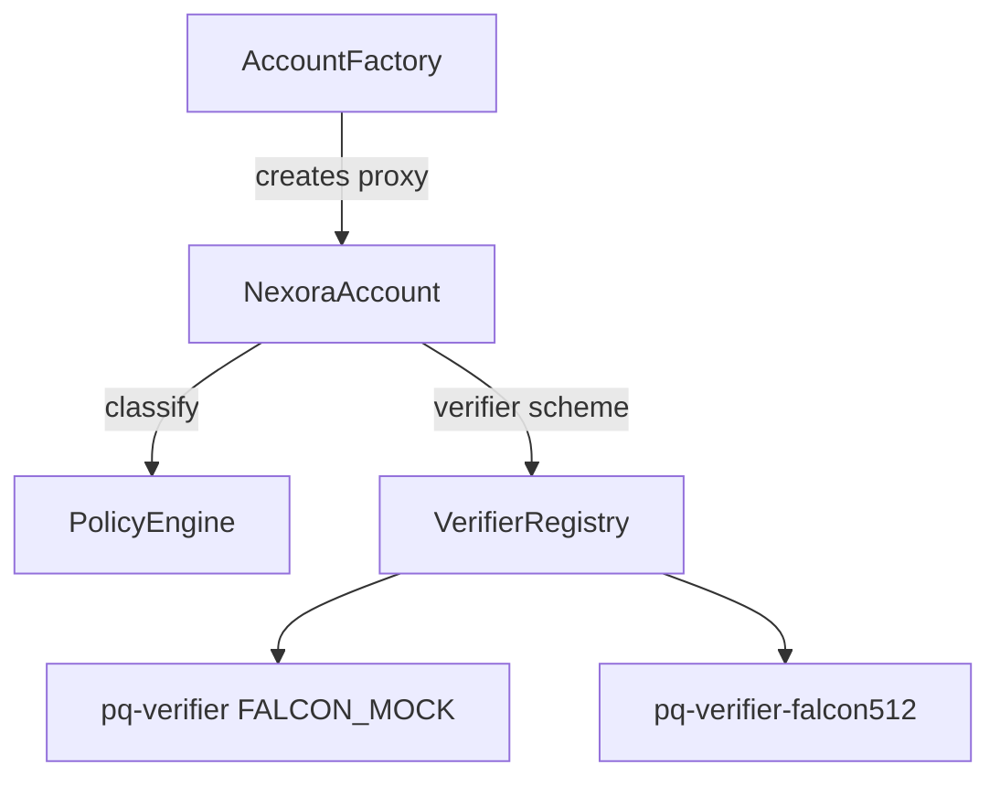

# Contracts

Implementation lives in **`contracts-stylus/`** (Rust / Stylus). Canonical
**Solidity interfaces**—for dapps, ABI generation, and audits—live in
**[`contracts-sol/src/`](../contracts-sol/src/)** and mirror the Stylus ABIs.

## Module map

| Stylus crate / contract | Role |
| --- | --- |
| [`nexora-account`](../contracts-stylus/nexora-account/) | Smart wallet: hybrid validator, `execute_user_op`, nonces, execution forward |
| [`account-factory`](../contracts-stylus/account-factory/) | EIP-1167 minimal proxy + CREATE2 deterministic deploy |
| [`verifier-registry`](../contracts-stylus/verifier-registry/) | Maps PQ scheme id → verifier contract address |
| [`policy-engine`](../contracts-stylus/policy-engine/) | Classifies calldata into LOW / HIGH / CRITICAL |
| [`pq-verifier`](../contracts-stylus/pq-verifier/) | Scheme **1** (`FALCON_MOCK`): lightweight reference verify |
| [`pq-verifier-falcon512`](../contracts-stylus/pq-verifier-falcon512/) | Scheme **2** (`FALCON_512`): real Falcon-512 verify |
| [`shared`](../contracts-stylus/shared/) | Shared types and EIP-712 op hash helpers (no verifier logic) |

See also the module table in [Architecture](architecture.md) (section 3).

## NexoraAccount

The **smart account** implementation. Validates `UserOp` payloads: ECDSA path,
PQ path via registry-resolved verifier, policy re-classification, nonce burn per
channel, then forwards the inner call.

- Interface: [`contracts-sol/src/INexoraAccount.sol`](../contracts-sol/src/INexoraAccount.sol)

## AccountFactory

Deploys minimal-proxy instances of `NexoraAccount` with deterministic addresses
from owner + PQ public-key hash + salt.

- Interface: [`contracts-sol/src/IAccountFactory.sol`](../contracts-sol/src/IAccountFactory.sol)

## VerifierRegistry

Single level of indirection: **`verifier(scheme) → address`**. Upgrading the
Falcon implementation or pointing a scheme at a precompile shim is a registry
update, not a wallet migration.

- Interface: [`contracts-sol/src/IVerifierRegistry.sol`](../contracts-sol/src/IVerifierRegistry.sol)

## PolicyEngine

On-chain rule table that **classifies** a proposed call (by target and selector)
into **LOW**, **HIGH**, or **CRITICAL**. The account and off-chain builders use
the same classification to decide ECDSA-only vs hybrid vs PQ-only paths.

- Interface: [`contracts-sol/src/IPolicyEngine.sol`](../contracts-sol/src/IPolicyEngine.sol)

## PQ verifiers (`IPQVerifier`)

Implement **`verify(bytes32 msgHash, bytes sig, bytes pubkey) → bool`** and
expose **`scheme()`** for the registry.

- Interface: [`contracts-sol/src/IPQVerifier.sol`](../contracts-sol/src/IPQVerifier.sol)
- **Scheme 1** — `pq-verifier`: deterministic reference encoding for fast local dev.
- **Scheme 2** — `pq-verifier-falcon512`: production-oriented Falcon-512 verify
  (encoding and measurements in [Architecture](architecture.md), section 5a).

## Shared (`contracts-stylus/shared`)

Rust library: EIP-712 **op hash** construction and types shared by the account
and tooling. **No** matching `IShared.sol`; consumers use generated ABIs from
the account or SDK.

## Relationship diagram

For validation sequencing and signature layout, read
[Architecture](architecture.md) (section 4).
