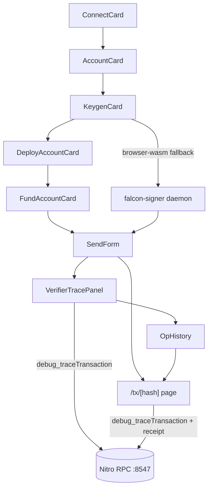

# Dashboard flow

The Nexora dashboard is a self-driving onboarding flow: connect a
wallet, generate quantum-resistant keys, deploy a smart account, fund
it, and exercise the policy engine. Each card is independently
addressable — clicking *Sign & send* with an unmet precondition jumps
back to the relevant card.

## ConnectCard

`dashboard/components/ConnectCard.tsx`. Handles the cold-start path —
choose a wagmi connector, then `wallet_addEthereumChain` for the Orbit
devnet (`NEXORA_CHAIN`).

## AccountCard

`dashboard/components/AccountCard.tsx`. Compact summary of the
connected EOA: address, ETH balance on the L3, chain id. No on-chain
state beyond `useBalance`.

## KeygenCard — step 1

`dashboard/components/KeygenCard.tsx`. Owns the Falcon-512 keystore.

- **Generate**: calls `generateBrowserKeypairAndStore()` from
  `dashboard/lib/falcon512Storage.ts`, which loads the wasm-bindgen
  bundle (`signer/falcon-signer-wasm`, served from
  `/wasm/falcon512/...`) and runs `keygen` with a 32-byte
  `crypto.getRandomValues` seed. Public key (897 B) and secret key
  (1281 B) are persisted under `nexora.falcon512.sk.v1`.
- **Re-generate / Clear**: opt-in destructive actions. Clearing or
  re-generating invalidates the deployed account because the
  `pqPubkeyHash` changes.
- **Signer source badge**: probes both the wasm bundle (`isWasmAvailable`)
  and the local daemon (`probeDaemon`). Possible states:
  - `signer · browser-wasm` (default, no extra processes)
  - `signer · daemon` (wasm unavailable, daemon reachable)
  - `signer · none` (both paths failed — surface in the UI)

There is **no auto-generation on page load**. The dashboard stays empty
until the user explicitly clicks *Generate*.

## DeployAccountCard — step 2

`dashboard/components/DeployAccountCard.tsx`. Computes the predicted
CREATE2 address by reading
`AccountFactory.predictAddress(owner, pqPubkeyHash, 0x0)`, then probes
`getCode` to decide whether the account is already live.

Clicking *Deploy smart account* calls `AccountFactory.createAccount`
through the connected EOA (wagmi `useWriteContract`) — the user pays L3
gas. Once the receipt confirms, the badge flips to `deployed` and
`onDeployed(address)` is fired up to the page so the rest of the cards
can pick it up.

The card is bound to whichever Falcon-512 keypair is currently in the
store, so re-generating keys creates a fresh predicted address that the
user must redeploy.

## FundAccountCard — step 3

`dashboard/components/FundAccountCard.tsx`. Live balance via
`useBalance` (auto-refreshes every 6 s). Sends ETH from the connected
EOA to the smart account by calling its payable
`fund()` selector (`0xb60d4288`); Stylus 0.6 doesn't expose a bare
`receive()` so plain transfers wouldn't credit the balance.

Quick-amount buttons (`0.01`, `0.1`, `1` ETH) cover the demo presets
(`0.001`/`0.05`/`0.5`). Once a tx confirms, the balance refetches.

## SendForm — step 4

`dashboard/components/SendForm.tsx`. The end-to-end UserOp pipeline.
The card replaces the previous single-line status with a 6-step stepper
that surfaces timing and sizes:

1. **classify policy** — `onchainClassify` against `PolicyEngine`.
2. **build UserOp** — fetch nonce per channel (`0` for LOW, `1`
   otherwise), compute the EIP-712 op hash.
3. **sign ECDSA** — `signers.signEcdsaOpHash` via wagmi wallet client.
   Skipped on CRITICAL.
4. **sign Falcon-512** — `resolveFalcon512Signer()` returns a
   `Falcon512Signer` whose `source` is either `browser-wasm` or
   `daemon`. The signature is the canonical 666-byte Falcon-512 output;
   the size is shown next to the step. Skipped on LOW.
5. **submit** — `executeUserOp(opBytes, providedPubkey)` against the
   smart account from the connected EOA.
6. **confirm** — `useWaitForTransactionReceipt` reports block number
   and gas used.

Preconditions (`keypair generated`, `account deployed`, `balance ≥
value + min gas`) are listed explicitly. Each unmet precondition
renders a *fix this* button that scrolls back to the offending card via
`onJumpToStep`.

The verifier dropdown defaults to **scheme 2 (Falcon-512)**.
`FALCON_MOCK` is hidden behind a *show legacy* checkbox for testing
parity with the agent demo, but the demo path itself is single-track.

## VerifierTracePanel — step 5

`dashboard/components/VerifierTracePanel.tsx`. Sits below the SendForm.
The form publishes `{ hash, tag, scheme }` after every successful
submit; the panel waits for the receipt, then calls
`debug_traceTransaction(hash, { tracer: "callTracer" })` against the
Nitro RPC (via the shared helpers in `dashboard/lib/trace.ts`).

The panel walks the resulting frame tree, finds every call whose `to`
matches `deployments.pqVerifierFalcon512` (case-insensitive), and
decodes each one through the existing `pqVerifierAbi`. For every match
it renders:

- A coloured badge (`verify · ok` / `verify · failed` / `skipped` /
  `no verify call`) reflecting the boolean output of
  `verify(bytes32,bytes,bytes)` and the policy tag.
- The decoded inputs — `msgHash`, signature size (`666 B (real
  Falcon-512)`), public-key size (`897 B (real Falcon-512)`), and the
  call's `gasUsed`.
- A compact, depth-indented call tree highlighting the verifier frame
  in green so visitors can see how the call sits inside
  `executeUserOp -> VerifierRegistry.getVerifier -> verify`.
- An "open trace ↗" link to the full-page explorer route below.

For LOW transactions the panel renders an explanatory `skipped` state
because the validator never reaches the PQ path.

## /tx/[hash] explorer page

`dashboard/app/tx/[hash]/page.tsx`. Self-contained Etherscan-style page
wired entirely through the Nitro RPC. For a given hash it fetches:

- `eth_getTransactionByHash` — from / to / value / nonce / gas price.
- `eth_getTransactionReceipt` — status, block, gas used, log count.
- `debug_traceTransaction` (Geth `callTracer`) — full call tree.

It then reuses the shared trace helpers to highlight every Falcon-512
verifier frame in the call tree, decodes the `verify(...)` inputs (sig
666 B, pubkey 897 B), and labels known contracts (`AccountFactory`,
`VerifierRegistry`, `pqVerifierFalcon512`, `BridgeMock`, …) in the
tree. No external explorer container is required — the dashboard *is*
the explorer for this devnet.

Stock Otterscan can't run against a Nitro node because it relies on
the Erigon-only `erigon_*` and `ots_*` RPC namespaces; this in-process
page sticks to the Geth-compatible `debug_*` API that Nitro already
exposes.

## OpHistory

`dashboard/components/OpHistory.tsx`. Streams `UserOpExecuted` events
from the smart account via `watchContractEvent`. Each row shows the op
hash, block, policy tag pill, scheme, and ok / revert pill, plus a
per-row `trace ↗` link to `/tx/[hash]` so historical ops can be
re-opened in the explorer view.

## Explorer helper

`dashboard/lib/explorer.ts`. Centralises tx URLs:

- `getExplorerBase()` — `null` by default (dashboard-internal). Returns
  `process.env.NEXT_PUBLIC_EXPLORER_URL` if set (no trailing slash).
- `txUrl(hash)` — `/tx/<hash>` when internal, `${base}/tx/<hash>`
  otherwise.
- `isInternalExplorer()` — boolean.
- `shortHex(...)` — `0x1234…abcd` formatter.

`SendForm`, `OpHistory`, `DeployAccountCard`, `FundAccountCard`, and
`VerifierTracePanel` all consume these helpers so a single env var
override (`NEXT_PUBLIC_EXPLORER_URL`) re-targets every link in the UI.

## Shared trace helpers

`dashboard/lib/trace.ts` exposes the call-tree primitives shared by
`VerifierTracePanel` and the `/tx/[hash]` page:

- `CallFrame` / `FlatFrame` — Geth `callTracer` shapes.
- `fetchCallTrace(client, hash)` — wraps the `debug_traceTransaction`
  RPC.
- `findVerifierCalls(root, verifier)` — collect all Falcon-512 frames.
- `flattenTree(root, verifier, limit?)` — depth-indented flat list.
- `decodeVerify(input)` — pulls `msgHash`, `sig`, `pubkey` out of a
  `verify(bytes32,bytes,bytes)` calldata.
- `decodeBoolOutput(output)` — Solidity `bool` decode.

## Storage and signer modules

- `dashboard/lib/falcon512Storage.ts` — keystore + signer factory.
  `readKeypair`, `generateBrowserKeypairAndStore`, `clearKeypair`,
  `probeDaemon`, `resolveFalcon512Signer`.
- `dashboard/lib/falcon512Browser.ts` — dynamic import of the wasm
  bundle from `/wasm/falcon512/nexora_falcon512.js`. Exposes
  `generateBrowserKeypair`, `signFalcon512Browser`,
  `makeBrowserFalcon512Adapter`.
- `wallet-sdk/src/signers/falcon512.ts` — backend-agnostic surface:
  `Falcon512Adapter`, `Falcon512Signer`, `makeFalcon512Signer`,
  `makeDaemonFalcon512Adapter`.

The dashboard is the only consumer that knows about wasm; the SDK only
sees the abstract `Falcon512Adapter` and is happy with whatever
implementation the host injects.

## Demo invariants

- `dashboard/public/deployments.json` does **not** contain a pre-baked
  `account`; the dashboard always derives addresses from the user's
  keypair.
- A clean browser profile (no localStorage, no daemon) can complete LOW
  + HIGH + CRITICAL UserOps end-to-end against a fresh devnet, with
  `pq-verifier-falcon512` (scheme 2) handling on-chain verification.
- Disabling JS WASM forces the daemon fallback (visible badge change).
  The signing surface degrades gracefully without code changes.
