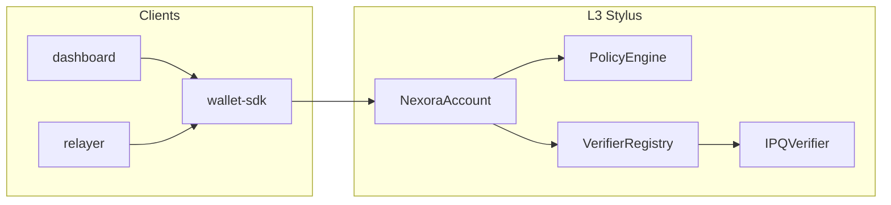

# Overview

Classical Ethereum accounts rely on ECDSA over curves that are not known to be
hard for a large-scale quantum computer. That is a **future consensus risk** for
assets and identities anchored to those keys today. Nexora does not pretend
that every user must abandon ECDSA overnight; it **layers** a post-quantum
verification path beside ECDSA so deployments can tighten policy over time.

## What Nexora is

Nexora is a **custom Arbitrum Orbit L3** plus a **Stylus** smart-account stack:

- A **hybrid ECDSA + post-quantum** validator on `NexoraAccount`, with rules
  enforced by an on-chain **PolicyEngine** (LOW / HIGH / CRITICAL).
- **PQ verification** behind a stable **`VerifierRegistry`** indirection so the
  concrete verifier (reference mock, real Falcon-512 in Stylus, or a future
  Nitro precompile) can be swapped **without redeploying wallets**.
- A TypeScript **wallet-sdk**, optional **relayer**, Next.js **dashboard**, and
  demo **agent** for end-to-end flows.

For implementation detail and module boundaries, read
[Architecture](architecture.md). For how this maps onto **EIP-8141** and the
**Vitalik** framing of isolated `VERIFY` frames and eventual proof aggregation,
see [Nexora and EIP-8141](eip8141-mapping.md).

## How a request flows (high level)

## Where to go next

| Topic | Document |
| --- | --- |
| Layers, validation flow, verifier swap | [Architecture](architecture.md) |
| EIP-8141 `SENDER` / `VERIFY` / `EXEC` mapping | [Nexora and EIP-8141](eip8141-mapping.md) |
| Stylus crates and Solidity interfaces | [Contracts](contracts.md) |
| Onboarding UI and cards | [Dashboard flow](dashboard-flow.md) |
| Threats and production checklist | [Threat model](threat-model.md) |

For repository layout, scripts, and hosted devnet URLs, the developer-oriented
entry is the root [README](../README.md).
