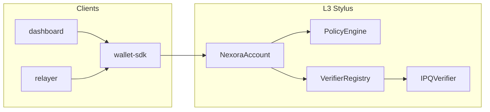

# Overview

Nexora pairs familiar **ECDSA** ownership with an on-chain **Falcon-512** path
via a **VerifierRegistry**, so **HIGH** and **CRITICAL** operations get
stronger guarantees (PQ co-signatures and timelock paths where policy defines
them) while everyday flows can stay lean. Swap verifier implementations behind
the registry without redeploying user accounts as the stack evolves toward
post-quantum verification at scale.

## What ships in the repo

1. **Arbitrum Orbit L3** configuration and scripts (`chain/`).
2. **Stylus contracts**: `NexoraAccount` (hybrid validator), `PolicyEngine`,
   `VerifierRegistry`, `AccountFactory`, PQ verifiers (`contracts-stylus/`).
3. **Solidity interfaces** only in `contracts-sol/` (ABI surface for tooling).
4. **`wallet-sdk`**, optional **`relayer`**, Next.js **`dashboard`**, demo **`agent`**.

For stack detail see [Architecture](architecture.md). For EIP-8141 framing see
[Nexora and EIP-8141](eip8141-mapping.md).

## Custody: EOA vs smart account

| Location | Who signs spends | Notes |
| --- | --- | --- |
| ETH on **EOA** | EOA private key only | Move value into the Nexora account when you want **[PolicyEngine](architecture.md)**-governed spends. |
| ETH on **smart account** | Whatever policy classifies for that `target` / `value` / `callData` | **HIGH**: ECDSA + PQ co-sign. **CRITICAL**: PQ-forward rules including timelock where configured. **LOW**: fast ECDSA-only path for small or routine operations. |

Funds on the smart account are where **HIGH** and **CRITICAL** protections apply;
see [Threat model](threat-model.md) for the full picture across bands.

## Request path (high level)

## Configuration and hosted devnet

URLs, chain id, `wallet_addEthereumChain`, and dashboard `NEXT_PUBLIC_*` vars
are collected in [Hosted configuration](hosted-configuration.md) so GitBook and
operators have one page without copying the full root README.

Repository layout, scripts, and contract address tables for the public devnet
stay in the root [README](../README.md).

## Where to go next

| Topic | Document |
| --- | --- |
| Layers, validation flow, verifier swap | [Architecture](architecture.md) |
| EIP-8141 mapping | [Nexora and EIP-8141](eip8141-mapping.md) |
| Stylus crates and interfaces | [Contracts](contracts.md) |
| Onboarding UI, lifecycle, presets | [Dashboard flow](dashboard-flow.md) |
| Policy bands and security model | [Threat model](threat-model.md) |
| RPC URLs and env vars | [Hosted configuration](hosted-configuration.md) |
